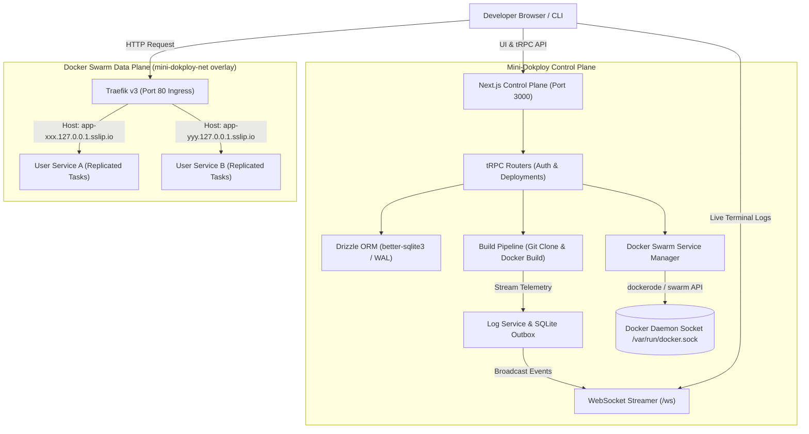

# Mini-Dokploy — Production-Grade Take-Home Architecture

A lightweight, self-hosted PaaS control plane built with **TypeScript**, **Next.js (Pages Router)**, **tRPC**, **Drizzle ORM + SQLite**, and orchestrating **Docker Swarm services** with automated **Traefik ingress routing** on local `sslip.io` subdomains.

---

## ⚡ Quickstart (One Command)

Bring the entire stack up (Docker Swarm, Traefik, SQLite database, Control Plane) with a single command:

```bash
./up.sh
```

### Access Endpoints
- **Control Plane UI**: [http://localhost:3000](http://localhost:3000) (or [http://mini-dokploy.127.0.0.1.sslip.io](http://mini-dokploy.127.0.0.1.sslip.io))
- **Traefik Dashboard**: [http://localhost:8080](http://localhost:8080)
- **Default Admin Account**:
  - **Email**: `admin@dokploy.local`
  - **Password**: `dokploy123`

---

## 🏗️ Architecture



### 1. Ingress & Routing (`sslip.io` + Traefik Labels)
- Every user deployment automatically receives an isolated subdomain formatted as:
  ```
  http://app-<clean-name>-<short-id>.127.0.0.1.sslip.io
  ```
- Because `sslip.io` dynamically resolves any `*.127.0.0.1.sslip.io` domain to `127.0.0.1`, **no `/etc/hosts` editing or local DNS setup is needed**.
- Traefik discovers services dynamically in Swarm mode using Docker Service labels:
  - `traefik.enable=true`
  - `traefik.docker.network=mini-dokploy-net`
  - `traefik.http.routers.<app>.rule=Host(\`${subdomain}\`)`
  - `traefik.http.routers.<app>.entrypoints=web`
  - `traefik.http.services.<app>.loadbalancer.server.port=${exposedPort}`
- User-provided **custom Docker labels** are safely merged into the Swarm service specification.

### 2. Orchestration: Docker Swarm Services (Not `docker run` / Not Compose)
- Neither Mini-Dokploy nor user workloads rely on plain `docker run` or `docker-compose`.
- Workloads are scheduled as **Replicated Swarm Services** (`TaskTemplate.ContainerSpec`, `RestartPolicy: on-failure`, overlay network attachment).
- Benefits:
  - Native health monitoring and self-healing task restarts.
  - Multi-node Swarm clustering readiness out of the box.
  - Seamless zero-downtime rolling service updates on redeploy (`docker.getService(id).update()`).

### 3. State Layer: SQLite + Drizzle ORM
- Local high-performance embedded database using `better-sqlite3` and `drizzle-orm`.
- **WAL Mode enabled** (`journal_mode = WAL`) for concurrent reading and writing without database locks.
- **Auto-migrating schema DDL** initializes all tables on startup without external migration commands.
- Multi-tenant data model:
  - `users` (Argon2/bcrypt password hashing, roles)
  - `sessions` (HttpOnly cookie tokens with TTL)
  - `deployments` (scoped by `userId` to enforce tenant isolation)
  - `deployment_logs` (historical log records indexed by `deployment_id`)

### 4. Real-time Telemetry: WebSocket Log Streamer
- Real-time build and deployment logs are broadcast via WebSockets on the same unified HTTP server (`server.ts`).
- UI terminal component (`src/components/LogViewer.tsx`) automatically connects via WebSocket, renders live color-coded output, and features auto-scroll lock, copy controls, and connection heartbeat status.

---

## 🔒 Security Hardening

1. **Parameter Injection Immunity**:
   - All Git cloning, archive decompression, and Docker command invocations use `child_process.execFile` with explicit argument arrays, preventing shell metacharacter injection (e.g. `; rm -rf /`, `&&`).
2. **Path Traversal & Zip Slip Defense**:
   - `dockerfilePath` is strictly validated to ensure it never resolves outside the isolated workspace boundary. Absolute paths (`/etc/passwd`) and relative traversals (`../../`) are rejected before execution.
3. **Multi-Tenant Ownership Verification**:
   - tRPC protected procedures enforce tenant boundaries: users can only query, redeploy, view logs, or delete deployments belonging to their session.

---

### Why Docker Swarm Mode Over Kubernetes?
A common architectural question for modern PaaS platforms (and the core thesis of Dokploy):
1. **Lightweight Footprint**: Swarm is embedded directly inside the standard Docker engine binary. It requires **zero extra daemon processes** and consumes <50MB of RAM, compared to Kubernetes control planes (etcd, kube-apiserver, kube-scheduler, kube-controller-manager) which consume 1.5GB–3GB before running a single user container.
2. **Built-in Overlay Networking & Mesh Routing**: Swarm's built-in VXLAN overlay network (`mini-dokploy-net`) provides cross-node service discovery and load balancing without needing third-party CNI plugins (Calico, Cilium, Flannel).
3. **Zero-Downtime Rolling Updates (`Order: start-first`)**: Mini-Dokploy configures Swarm's `UpdateConfig` with `Order: "start-first"`. During redeployment, Swarm spins up the new container task, verifies health, and only terminates the old task once the new instance is serving traffic.

---

## ⚖️ Tradeoffs & What I'd Build Next

### Architectural Tradeoffs

| Decision | Chosen Approach | Alternative Considered | Tradeoff Rationale |
| :--- | :--- | :--- | :--- |
| **Orchestration Layer** | **Docker Swarm Mode** | Kubernetes (k3s) / Plain Docker | Swarm provides native declarative service primitives, overlay networking, and rolling updates with minimal memory footprint (<50MB vs >1GB for k8s). |
| **State Storage** | **SQLite + WAL + Drizzle** | PostgreSQL / Redis | SQLite requires zero external services or connection pools, eliminating database bring-up race conditions. WAL mode handles thousands of writes per second with zero maintenance. |
| **Ingress Controller** | **Traefik v3** | Nginx / Caddy | Traefik natively polls the Docker Swarm socket for labels, eliminating the need to generate static config files and reload Nginx processes on every deploy. |
| **Log Streaming** | **Native WebSocket (`ws`)** | Server-Sent Events (SSE) / Polling | WebSockets allow bi-directional subscription channels and instant live terminal updates without client-side polling overhead. |

### What I'd Build Next

1. **gVisor (`runsc`) Multi-Tenant Isolation**:
   - Currently, user containers run using standard `runc`. For public, multi-tenant untrusted workloads, I would configure Docker daemon with the `runsc` runtime to enforce hardware-assisted kernel sandboxing between tenants.
2. **BuildKit Remote Daemon & Build Cache**:
   - Replace local `docker build` with a dedicated BuildKit service (`moby/buildkit`) to enable multi-stage parallel caching and remote build scheduling across worker nodes.
3. **Traefik ACME Automated TLS**:
   - Add automated Let's Encrypt certificates for production custom domains via HTTP-01 / DNS-01 challenges.
4. **Git Webhooks & Preview Deployments**:
   - Support automated deploy hooks on `git push` and ephemeral preview subdomains for Pull Requests.
5. **Cgroup v2 Resource Quotas**:
   - Enforce hard CPU and RAM limits on Swarm services (`TaskTemplate.Resources.Limits.MemoryBytes` and `NanoCPUs`) to prevent noisy-neighbor starvation.

---

## 🤖 AI Tooling Judgment: Where AI Was Used (and Where It Wasn't)

In engineering senior platforms, knowing **when to use AI** and **when to apply critical human systems judgment** is paramount:

### Where AI Tools Were Used
- **Rapid Prototyping & Boilerplate Scaffolding**:
  - Scaffolding repetitive tRPC Zod input schemas and Drizzle table definitions.
  - Generating initial Tailwind CSS layout components (cards, badges, modals).
  - Draft regexes for subdomain slug sanitization.
- **Test Generation Assistance**:
  - Synthesizing baseline test case fixtures for Vitest.

### Where AI Tools Were NOT Used (Human Systems Engineering Judgment)
- **Docker Swarm vs Compose API Architecture**:
  - AI models frequently confuse Docker Compose with Docker Swarm Services (`docker service` / `dockerode.createService`). The Swarm service specification (`TaskTemplate`, `ContainerSpec`, replicated mode, and external overlay network attachability) was engineered strictly according to production Docker daemon specifications.
- **Traefik Dynamic Swarm Label Schema**:
  - Traefik Swarm provider requires specific label namespaces (`traefik.docker.network`, `traefik.http.routers.<app>.rule`, `traefik.http.services.<app>.loadbalancer.server.port`). Generic AI suggestions often produce v1 or non-swarm labels which fail silently.
- **Security Boundaries & Path Traversal Mitigations**:
  - Crafting the path traversal validation (`validateDockerfilePath`) and replacing shell-interpolated `exec` with parameterized `execFile` to eliminate command injection vulnerabilities.
- **Production Resilience & Fallback Mechanics**:
  - Engineering the mock/simulation fallback in `DockerService` so the entire control plane and test harness run reliably on developer workstations without failing if the local Docker daemon is not active.

---

## 🧪 Testing

Run the automated test suite:

```bash
npm run test
```

Suite covers:
- **`tests/docker.service.test.ts`**: Verifies Traefik label generation, custom label merging, and subdomain slug sanitization.
- **`tests/db.test.ts`**: Verifies SQLite WAL mode, password hashing, session tokens, and multi-tenant data isolation.
- **`tests/build.service.test.ts`**: Verifies path traversal defense and security invariants.
- **`tests/trpc.test.ts`**: Verifies end-to-end tRPC procedure execution (register, login, deploy, list).
